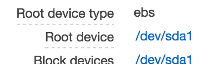
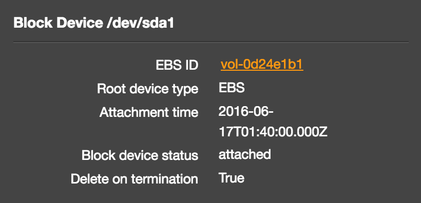
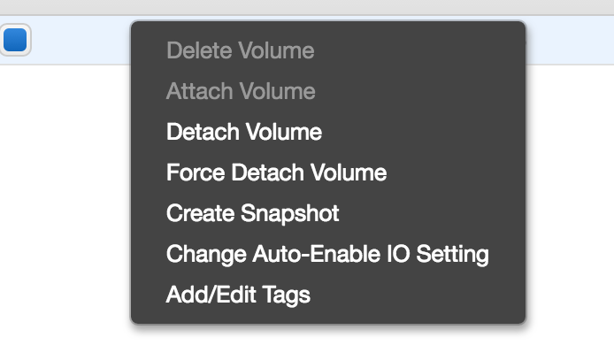
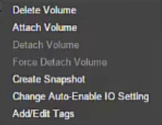
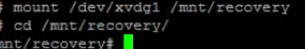

### Replcae a lost .pem file on an EC2 instance

1. Launch an instance in the smae subnet, create a new .pem file
2. Stop the lost key instance and detach the disk(/dev/sda1)

3. Attach the volume to the new instance as a secondary disk
4. Connecting new instance via ssh
5. Mount the lost key disk in your new instance

6. Replace the ssh key to the lost key disk, command:(cat /home/ubuntu/.ssh/authorized_keys >> /mnt/.../home/.../.ssh/authorized_keys)
7. Exit and stop the new instance
8. Detach the second disk from the new instance
9. Attach the lostkey volumn to the lost key instance
10. Start the lost key instance then you can use new .pem file to log in.